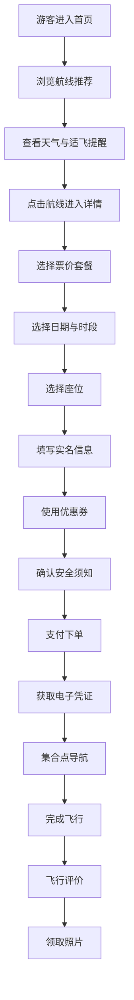
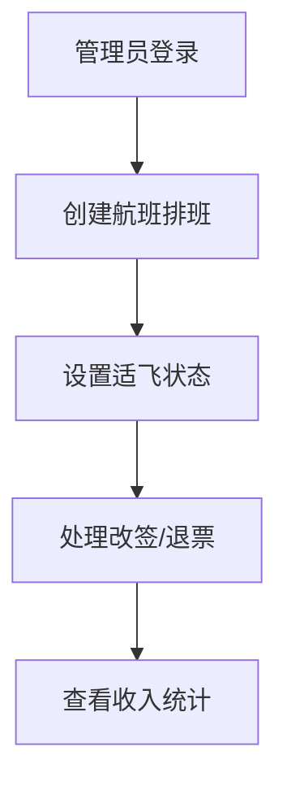

## 1. 产品概述

面向县域文旅景区的低空游览预约平台，服务于拥有峡谷、茶山、古村等自然人文景观的县域景区，让游客能够通过小型飞行器（热气球、直升机、滑翔伞等）俯瞰全景。平台覆盖从浏览线路、在线预约、支付出票到飞行后评价的全流程，同时为管理端提供排班调度与收入统计能力，助力旺季快速接单。

- 目标用户：来景区游览的散客及团队游客、景区运营管理人员
- 核心价值：将低空游览从线下问询升级为线上全流程预约，提高旺季接待效率与游客体验

## 2. 核心功能

### 2.1 用户角色

| 角色 | 注册方式 | 核心权限 |
|------|----------|----------|
| 游客 | 手机号注册/微信授权 | 浏览航线、预约下单、支付、改签退票、评价、领取照片 |
| 管理员 | 后台账号分配 | 航班排班、适飞管理、订单处理、查看收入统计 |

### 2.2 功能模块

**游客端（5个页面）：**

1. **首页**：英雄区航线推荐、天气与适飞提醒、优惠券领取入口、热门航线卡片
2. **航线详情页**：航线图文/视频介绍、票价套餐选择、日历预约、座位选择
3. **预约下单页**：游客实名信息填写、优惠券使用、安全须知确认、订单支付
4. **订单中心页**：订单列表与详情、改签/退票、电子凭证、集合点导航
5. **评价与客服页**：飞行后评价、游客照片领取、在线客服咨询

**管理端（2个页面）：**

6. **排班管理页**：航班排班日历、天气适飞状态管理、订单查看与处理
7. **收入统计页**：收入趋势图表、航线/日期维度统计、订单汇总导出

### 2.3 页面详情

| 页面名称 | 模块名称 | 功能描述 |
|----------|----------|----------|
| 首页 | 英雄区 | 全屏背景图展示峡谷/茶山/古村全景，叠加核心CTA"立即预约" |
| 首页 | 天气与适飞提醒 | 实时天气卡片，显示温度、风力、能见度，标注是否适飞 |
| 首页 | 热门航线推荐 | 三条航线（峡谷穿越/茶山云海/古村鸟瞰）卡片，含标签、价格、时长 |
| 首页 | 优惠券入口 | 可领取优惠券列表，点击领取并跳转预约 |
| 航线详情页 | 航线介绍 | 图文/视频展示航线风景、飞行器类型、飞行高度与时长 |
| 航线详情页 | 票价套餐 | 标准票/VIP票/情侣套票等，含价格、包含服务说明 |
| 航线详情页 | 日历预约 | 日历组件选择日期，显示可飞时段与余座 |
| 航线详情页 | 座位选择 | 飞行器座位图，可点击选择剩余座位 |
| 预约下单页 | 游客实名信息 | 姓名、身份证号、联系电话、体重（安全限制） |
| 预约下单页 | 优惠券使用 | 选择已领取的优惠券，自动计算优惠后价格 |
| 预约下单页 | 安全须知确认 | 安全条款勾选确认，未确认不可提交 |
| 预约下单页 | 订单支付 | 支付方式选择，模拟支付流程 |
| 订单中心页 | 订单列表 | 按状态筛选订单（待支付/已预约/已完成/已取消） |
| 订单中心页 | 改签/退票 | 选择订单进行改签（更换日期时段）或退票（按退票规则） |
| 订单中心页 | 电子凭证 | 已支付订单生成电子凭证二维码，入场核销 |
| 订单中心页 | 集合点导航 | 显示集合点地址与地图定位，支持导航跳转 |
| 评价与客服页 | 飞行后评价 | 星级评分+文字评价+上传照片 |
| 评价与客服页 | 游客照片领取 | 飞行中拍摄的照片，游客可下载 |
| 评价与客服页 | 在线客服 | 常见问题FAQ + 在线聊天窗口 |
| 排班管理页 | 航班排班日历 | 按日期/航线创建航班时段，设置容量和价格 |
| 排班管理页 | 适飞状态管理 | 按日期标记适飞/不适飞，关联天气信息 |
| 排班管理页 | 订单查看处理 | 查看所有预约订单，处理改签/退票申请 |
| 收入统计页 | 收入趋势 | 按日/周/月的收入折线图 |
| 收入统计页 | 维度统计 | 按航线、套餐类型的收入占比饼图 |
| 收入统计页 | 订单汇总 | 订单数量、总金额、退款金额等汇总卡片 |

## 3. 核心流程

**游客预约流程：**
1. 游客进入首页，浏览推荐航线，查看天气适飞状态
2. 点击航线卡片进入详情页，了解航线信息与票价套餐
3. 选择日期和时段，选择座位，进入预约下单页
4. 填写实名信息，选择优惠券，确认安全须知
5. 支付完成，获得电子凭证
6. 飞行日到达集合点（通过导航），完成飞行体验
7. 飞行后进行评价，领取飞行照片

**管理端流程：**
1. 管理员登录，设置航班排班（日期/时段/座位数）
2. 根据天气标记适飞状态
3. 处理游客改签/退票申请
4. 查看收入统计数据

## 4. 用户界面设计

### 4.1 设计风格

- **设计理念**：云端漫步 · 山水之间 — 以天空渐变与山水剪影为核心视觉语言，营造"飞翔于天地间"的沉浸感
- **主色调**：天空蓝渐变（#0EA5E9 → #38BDF8）搭配暖阳金（#F59E0B）点缀
- **辅助色**：山峦深蓝（#1E3A5F）、云白（#F8FAFC）、峡谷岩石灰（#64748B）
- **按钮风格**：圆角（rounded-xl）、微投影、主按钮渐变填充、次按钮描边
- **字体**：标题使用 Noto Serif SC（衬线体体现山水人文），正文使用 Noto Sans SC
- **布局风格**：卡片式布局，圆角大间距，毛玻璃效果导航栏
- **图标风格**：Lucide 线性图标，搭配小面积装饰性云纹/山纹

### 4.2 页面设计概览

| 页面名称 | 模块名称 | UI元素 |
|----------|----------|--------|
| 首页 | 英雄区 | 全屏背景渐变+山峦剪影装饰，大标题+副标题+CTA按钮，缓慢浮动云朵动画 |
| 首页 | 天气卡片 | 毛玻璃卡片，温度/风力/能见度指标，适飞状态徽章（绿色可飞/红色停飞） |
| 首页 | 航线卡片 | 横向滚动卡片组，圆角大图+渐变遮罩文字，悬浮微抬升效果 |
| 航线详情页 | 航线介绍 | 顶部大图+视差滚动，信息指标横向排列（时长/高度/距离） |
| 航线详情页 | 套餐选择 | 卡片式单选，选中态金色边框+勾选图标 |
| 航线详情页 | 日历预约 | 自定义日历组件，可飞日期蓝色圆点，选中态实心填充 |
| 航线详情页 | 座位图 | 简化飞行器俯视图，可点击座位，已占灰色/可选蓝色/选中金色 |
| 预约下单页 | 实名表单 | 分组表单卡片，输入框底部描边聚焦效果 |
| 预约下单页 | 安全须知 | 弹窗式协议，需滑动到底部才能勾选确认 |
| 订单中心页 | 订单卡片 | 左侧状态色条+右侧信息，悬浮展开操作按钮 |
| 订单中心页 | 电子凭证 | 二维码卡片，渐变边框装饰，长按保存提示 |
| 评价与客服页 | 评价组件 | 星级点击+文本域+图片上传网格 |
| 评价与客服页 | 聊天窗口 | 右下角悬浮气泡，展开为聊天面板 |
| 排班管理页 | 排班日历 | 月视图网格，时段色块标记，点击弹出编辑 |
| 收入统计页 | 图表区域 | 渐变填充折线图+环形占比图，数据卡片组 |

### 4.3 响应式设计

- 桌面优先设计，最小宽度1200px
- 平板适配（768-1024px）：卡片从3列变2列，侧边导航收起
- 移动端适配（<768px）：单列布局，底部Tab导航，日历纵向滚动

### 4.4 交互特效

- 首页英雄区：云朵缓慢飘动CSS动画，视差滚动效果
- 卡片悬浮：translateY(-4px) + shadow增强
- 页面切换：淡入淡出过渡
- 按钮：hover渐变位移+active缩放
- 日历：选中日期弹跳动画
- 适飞状态：脉冲呼吸灯效果
