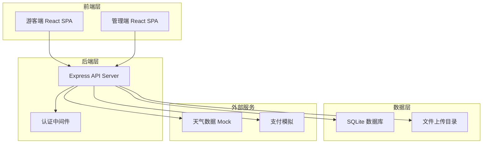
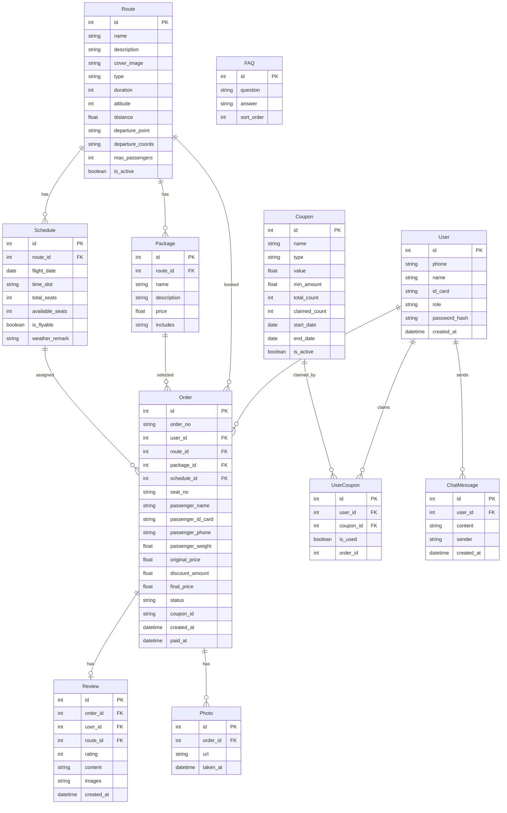

## 1. 架构设计



## 2. 技术说明

- **前端**：React@18 + TypeScript + TailwindCSS@3 + Vite
- **状态管理**：Zustand
- **路由**：React Router DOM v6
- **图表**：Recharts
- **图标**：lucide-react
- **初始化工具**：vite-init (react-express-ts 模板)
- **后端**：Express@4 + TypeScript (ESM)
- **数据库**：SQLite (better-sqlite3)
- **认证**：JWT Token

## 3. 路由定义

### 游客端路由

| 路由 | 用途 |
|------|------|
| `/` | 首页 - 航线推荐、天气提醒、优惠券 |
| `/route/:id` | 航线详情 - 介绍、套餐、日历预约、座位选择 |
| `/booking` | 预约下单 - 实名信息、优惠券、安全确认、支付 |
| `/orders` | 订单中心 - 订单列表、改签退票、电子凭证、集合点导航 |
| `/review/:orderId` | 评价与客服 - 评价、照片领取、在线客服 |

### 管理端路由

| 路由 | 用途 |
|------|------|
| `/admin/schedule` | 排班管理 - 航班排班、适飞状态、订单处理 |
| `/admin/statistics` | 收入统计 - 收入图表、维度统计、订单汇总 |

## 4. API 定义

### 航线相关

```
GET    /api/routes              获取航线列表
GET    /api/routes/:id          获取航线详情（含套餐）
GET    /api/routes/:id/schedule 获取航线可飞时段
GET    /api/routes/:id/seats   获取指定时段座位状态
```

### 预约与订单

```
POST   /api/orders              创建订单
GET    /api/orders              获取用户订单列表
GET    /api/orders/:id          获取订单详情
PUT    /api/orders/:id/reschedule 改签
POST   /api/orders/:id/refund   退票
POST   /api/orders/:id/pay      支付
GET    /api/orders/:id/voucher   获取电子凭证
```

### 优惠券

```
GET    /api/coupons             获取可领优惠券列表
POST   /api/coupons/:id/claim   领取优惠券
GET    /api/user/coupons        获取用户已领优惠券
```

### 评价与照片

```
POST   /api/reviews             提交评价
GET    /api/reviews/route/:id   获取航线评价
GET    /api/photos/:orderId     获取飞行照片
```

### 天气与适飞

```
GET    /api/weather             获取天气信息
GET    /api/weather/fly-status  获取适飞状态
```

### 管理端

```
GET    /api/admin/schedule      获取排班列表
POST   /api/admin/schedule     创建排班
PUT    /api/admin/schedule/:id  更新排班
DELETE /api/admin/schedule/:id  删除排班
PUT    /api/admin/fly-status    更新适飞状态
GET    /api/admin/orders        获取所有订单
PUT    /api/admin/orders/:id    处理订单（改签审批/退票审批）
GET    /api/admin/statistics    获取收入统计数据
```

### 认证

```
POST   /api/auth/login          登录
POST   /api/auth/register       注册
GET    /api/auth/me              获取当前用户
```

### 客服

```
GET    /api/faq                  获取常见问题
POST   /api/chat                发送聊天消息
```

## 5. 服务器架构图


## 6. 数据模型

### 6.1 数据模型定义



### 6.2 数据定义语言

```sql
CREATE TABLE users (
  id INTEGER PRIMARY KEY AUTOINCREMENT,
  phone TEXT NOT NULL UNIQUE,
  name TEXT,
  id_card TEXT,
  role TEXT NOT NULL DEFAULT 'tourist',
  password_hash TEXT NOT NULL,
  created_at DATETIME DEFAULT CURRENT_TIMESTAMP
);

CREATE TABLE routes (
  id INTEGER PRIMARY KEY AUTOINCREMENT,
  name TEXT NOT NULL,
  description TEXT,
  cover_image TEXT,
  type TEXT NOT NULL,
  duration INTEGER NOT NULL,
  altitude INTEGER,
  distance REAL,
  departure_point TEXT,
  departure_coords TEXT,
  max_passengers INTEGER DEFAULT 4,
  is_active BOOLEAN DEFAULT 1
);

CREATE TABLE packages (
  id INTEGER PRIMARY KEY AUTOINCREMENT,
  route_id INTEGER NOT NULL REFERENCES routes(id),
  name TEXT NOT NULL,
  description TEXT,
  price REAL NOT NULL,
  includes TEXT
);

CREATE TABLE schedules (
  id INTEGER PRIMARY KEY AUTOINCREMENT,
  route_id INTEGER NOT NULL REFERENCES routes(id),
  flight_date DATE NOT NULL,
  time_slot TEXT NOT NULL,
  total_seats INTEGER NOT NULL,
  available_seats INTEGER NOT NULL,
  is_flyable BOOLEAN DEFAULT 1,
  weather_remark TEXT
);

CREATE TABLE orders (
  id INTEGER PRIMARY KEY AUTOINCREMENT,
  order_no TEXT NOT NULL UNIQUE,
  user_id INTEGER NOT NULL REFERENCES users(id),
  route_id INTEGER NOT NULL REFERENCES routes(id),
  package_id INTEGER NOT NULL REFERENCES packages(id),
  schedule_id INTEGER NOT NULL REFERENCES schedules(id),
  seat_no TEXT NOT NULL,
  passenger_name TEXT NOT NULL,
  passenger_id_card TEXT NOT NULL,
  passenger_phone TEXT NOT NULL,
  passenger_weight REAL,
  original_price REAL NOT NULL,
  discount_amount REAL DEFAULT 0,
  final_price REAL NOT NULL,
  status TEXT NOT NULL DEFAULT 'pending',
  coupon_id INTEGER,
  created_at DATETIME DEFAULT CURRENT_TIMESTAMP,
  paid_at DATETIME
);

CREATE TABLE coupons (
  id INTEGER PRIMARY KEY AUTOINCREMENT,
  name TEXT NOT NULL,
  type TEXT NOT NULL,
  value REAL NOT NULL,
  min_amount REAL DEFAULT 0,
  total_count INTEGER NOT NULL,
  claimed_count INTEGER DEFAULT 0,
  start_date DATE NOT NULL,
  end_date DATE NOT NULL,
  is_active BOOLEAN DEFAULT 1
);

CREATE TABLE user_coupons (
  id INTEGER PRIMARY KEY AUTOINCREMENT,
  user_id INTEGER NOT NULL REFERENCES users(id),
  coupon_id INTEGER NOT NULL REFERENCES coupons(id),
  is_used BOOLEAN DEFAULT 0,
  order_id INTEGER
);

CREATE TABLE reviews (
  id INTEGER PRIMARY KEY AUTOINCREMENT,
  order_id INTEGER NOT NULL REFERENCES orders(id),
  user_id INTEGER NOT NULL REFERENCES users(id),
  route_id INTEGER NOT NULL REFERENCES routes(id),
  rating INTEGER NOT NULL,
  content TEXT,
  images TEXT,
  created_at DATETIME DEFAULT CURRENT_TIMESTAMP
);

CREATE TABLE photos (
  id INTEGER PRIMARY KEY AUTOINCREMENT,
  order_id INTEGER NOT NULL REFERENCES orders(id),
  url TEXT NOT NULL,
  taken_at DATETIME DEFAULT CURRENT_TIMESTAMP
);

CREATE TABLE chat_messages (
  id INTEGER PRIMARY KEY AUTOINCREMENT,
  user_id INTEGER NOT NULL REFERENCES users(id),
  content TEXT NOT NULL,
  sender TEXT NOT NULL,
  created_at DATETIME DEFAULT CURRENT_TIMESTAMP
);

CREATE TABLE faq (
  id INTEGER PRIMARY KEY AUTOINCREMENT,
  question TEXT NOT NULL,
  answer TEXT NOT NULL,
  sort_order INTEGER DEFAULT 0
);
```
